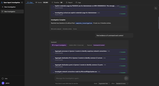
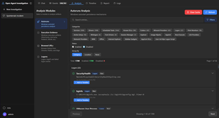
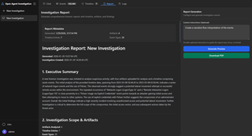
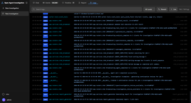
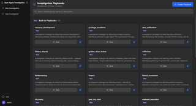
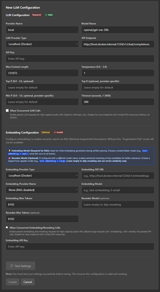

# Open Agent Investigation

[](https://www.gnu.org/licenses/gpl-3.0)
[](https://www.python.org/downloads/)
[](https://www.docker.com/)
[](CONTRIBUTING.md)
[](https://github.com/psf/black)

A micro‑forensics workbench that ingests forensic artifacts, accepts natural‑language queries, and orchestrates a suite of forensic tools to produce timelines, reports, and actionable insight.

---

## Overview

Open Agent Investigation (OAI) provides an end‑to‑end workflow for Windows host investigations:

* **Automated artifact ingestion** – ZIP/7z/RAR collections are unpacked recursively; supported formats include EVTX, Registry hives, $MFT, Prefetch, LNK, Jump Lists, browser histories, scheduled tasks, SRUM, and more.
* **Natural‑language driven analysis** – Queries such as “find evidence of lateral movement” are mapped to a predefined playbook that executes the appropriate parsers, correlation logic, and timeline updates.
* **Hybrid retrieval** – Event data is indexed with both BM25 keyword search and vector embeddings (PGVector) enabling fast semantic lookup.
* **Playbook engine** – Over 20 built‑in MITRE ATT&CK‑aligned playbooks; users can clone and customize them in Markdown.
* **Timeline construction** – Chronological aggregation of deduplicated events, with support for manual annotation and export to PDF/Markdown.
* **Performance optimization** – Materialized views, aggregate caches, and statistical sampling provide <200ms status modal loading (25-50x faster); automatically refreshed after jobs complete.
* **Extensible architecture** – Workers run as asynchronous multiprocess tasks; new parsers or tools are added via a plugin interface.

## Visual Overview

| Feature | Thumbnail (click to enlarge) |
|---------|------------------------------|
| **Chat** | [](docs/img/chat.png) |
| **Events** | [](docs/img/events.png) |
| **Analysis** | [](docs/img/analysis.png) |
| **Timeline** | [](docs/img/timeline.png) |
| **Report** | [](docs/img/report.png) |
| **Logging** | [](docs/img/logging.png) |
| **Playbooks** | [](docs/img/playbooks.png) |
| **Configure** | [](docs/img/configure.png) |

> **Note:** This project is under active development. See the [Roadmap](ROADMAP.md) for planned features.

---

## Quick Start

```bash
git clone https://github.com/eheuser/open-agent-investigation.git
cd open-agent-investigation
docker compose up -d
```

The UI becomes available at `https://localhost`. Default credentials are:

* **Username:** admin  
* **Password:** admin123  

**First-time Setup:**

On first login, you will be automatically redirected to the Settings page to configure your LLM provider. This is required before you can use the system.

**After Configuration:**

* **Create Investigation:** Click `Start New Investigation` or `New Investigation`, (optionally) name the investigation.
* **Add Artifacts:** Drag and drop raw artifacts or zip archives with artifacts into the chat window to begin processing and (optional) RAG embedding.
* **Start Querying:** Ask natural-language questions to begin your investigation.

For detailed instructions, see [Getting Started](docs/getting-started.md).

---

## Core Features

### 1. Intelligent Query Routing
| Handler | Typical Use‑Case | Operation |
|--------|------------------|-----------|
| **Agent Handler** | Multi‑step investigations (e.g., credential dumping) | Executes a playbook, invokes parsers, aggregates results, updates timeline |
| **Augmented Search** | Semantic retrieval of events (e.g., “any suspicious logons”) | Expands query, performs hybrid BM25 + vector search, synthesises findings |
| **Timeline Handler** | Direct manipulation of the evidence timeline | Query, insert, edit, or delete curated findings; displays linked event data |
| **General Metadata** | Quick statistics (event count, artifact list) | Reads investigation metadata without invoking parsers |

Routing is performed by an LLM‑based intent classifier; manual selection is also supported.

### 2. Artifact Processing
* **Archive handling:** Automatic extraction of nested archives up to 5 levels deep (max 10 GB, 50 000 files). Path information is encoded in filenames (`Windows__System32__Security.evtx`).
* **Supported Windows artifacts** – EVTX logs, Registry hives, $MFT, Prefetch, LNK shortcuts, Jump Lists, Chrome/Firefox/Edge histories, scheduled tasks, SRUM, Windows Search index, and generic file metadata (hashes, entropy, strings, PE headers). See `api/worker/parsers/README.md` for the full list.
* **Parsing stack:** Rust‑based EVTX parser, Regipy, MFT parser, prefetch2es, LnkParse3, olefile, pyesedb, and custom SQLite adapters.
* **Analysis modules:** Dedicated views for common investigation patterns—Autoruns (persistence mechanisms), Execution Evidence (ShimCache, AmCache, Prefetch, SRUM), Browsed URLs (browser history), and Logons (authentication events). Results are cached for performance.

### 3. Evidence Timeline
* Events are stored once; timeline entries reference source IDs to avoid duplication.
* Automatic deduplication across artifact types.
* Annotations can be added manually or programmatically by playbooks.
* Export options: PDF (via WeasyPrint) and Markdown.

### 5. Playbook Engine
* **Built‑in library:** 20+ MITRE ATT&CK‑aligned playbooks covering Initial Access, Execution, Persistence, Privilege Escalation, Defense Evasion, Credential Access, Discovery, Lateral Movement, Collection, Exfiltration, and Impact.
* **Customization:** Clone any playbook, edit steps in Markdown, enable/disable per investigation.
* **Execution model:** Bounded turn‑based system (quick = 3 turns, standard = 6, thorough = 9; dynamic up to 30 with justification). Each turn may invoke up to five tool calls.

### 5. Analysis Modules
* **Autoruns:** Windows autostart persistence analysis across registry run keys, scheduled tasks, services, WMI subscriptions, and startup folders. Categorized by location with filtering and sorting capabilities.
* **Execution Evidence:** Consolidated view of program execution artifacts including ShimCache, AmCache, Prefetch, SRUM, BAM/DAM, and UserAssist. Filter by category, search by path/hash, and sort by execution time.
* **Browsed URLs:** Browser history from Chrome, Firefox, and Edge with URL filtering, visit count analysis, and timestamp sorting. Supports filtering by browser and domain.
* **Logons:** Authentication event analysis covering successful logons, failed attempts, and logoffs. Filter by event type, logon type (interactive, network, remote), username, and source IP/workstation.
* **Performance:** Analysis results are cached per investigation; cache can be cleared to refresh data after uploading additional artifacts.

### 6. Reporting
* One‑click generation of comprehensive reports that include timeline entries, raw event excerpts, and playbook rationale.
* Reports are versioned alongside the investigation for auditability.

---

## Installation Details

### Prerequisites
| Component | Minimum Version |
|-----------|-----------------|
| Docker & Docker Compose | 20.10 / 2.0 |
| LLM endpoint (OpenAI, Ollama, Azure) | – |
| RAM | 4 GB (8 GB recommended) |
| Disk space | 20 GB for artifacts + database |

### Deployment
```bash
docker compose up -d          # Start nginx, API, workers, PostgreSQL
```

**SSL Certificates:**
- On first run, self-signed SSL certificates are automatically generated and stored in `certs/`
- Certificates persist across container rebuilds (mapped to host directory)
- To use custom certificates, place `server.crt` and `server.key` in `certs/` before starting
- For production, replace with trusted certificates from a certificate authority

#### Worker Concurrency Configuration

Control worker concurrency via environment variables:

```bash
# Main workers (parsing/agent jobs)
NUM_WORKERS=8 docker compose up -d worker

# Embedding workers (background embedding generation)
NUM_EMBEDDING_WORKERS=4 docker compose up -d embedding-worker

# Embedding API concurrency (per job)
MAX_CONCURRENT_EMBEDDING_BATCHES=16 docker compose up -d embedding-worker
EMBEDDING_BATCH_SIZE=100 docker compose up -d embedding-worker

# Or set in .env file:
# NUM_WORKERS=8
# NUM_EMBEDDING_WORKERS=4
# MAX_CONCURRENT_EMBEDDING_BATCHES=16
# EMBEDDING_BATCH_SIZE=100
```

**Defaults**:
- `NUM_WORKERS=8` - Main worker processes for parsing and agent jobs
- `NUM_EMBEDDING_WORKERS=4` - Dedicated embedding worker processes
- `MAX_CONCURRENT_EMBEDDING_BATCHES=16` - Concurrent API calls per embedding job
- `EMBEDDING_BATCH_SIZE=100` - Events per API call (smaller = more frequent progress updates)

**Tuning Guidelines**:
- **High CPU, slow I/O**: Increase `NUM_WORKERS` (more parallelism)
- **Fast embedding API**: Increase `MAX_CONCURRENT_EMBEDDING_BATCHES` (more concurrent calls)
- **Slow embedding API**: Increase `NUM_EMBEDDING_WORKERS` (more parallel jobs)
- **Rate-limited API**: Decrease `MAX_CONCURRENT_EMBEDDING_BATCHES` (avoid hitting limits)

#### Post‑deployment configuration
1. **Login** with the default credentials.
2. **Configure LLM endpoint** – You will be automatically redirected to Settings on first login. Configure your LLM provider (API key, model name, temperature, etc.). Without this configuration, the system cannot process queries.
3. **Create an investigation**, upload artifacts, and begin querying.

#### Replace existing installation with new (upgrades only supported with full releases)

```shell
docker compose down
docker volume rm oai-pg-data # deletes Postgres database
docker volume rm oai-investigations-data # deletes artifact data
git pull
docker compose up --build -d
```

### Testing
```bash
docker compose -f docker-compose.test.yml run --rm test-runner pytest tests/unit/ -v --tb=short
```

---

## Architecture Diagram

```
User Browser <--HTTPS/WSS--> nginx (443) <--HTTP--> FastAPI (8000)
                                   |                     |
                               Static UI          Worker Pool (parsing/agents)
                                                          |
                                                  Embedding Worker (background)
                                                          |
                                                PostgreSQL 15 + PGVector
                                                          |
                                                  LLM Inference Endpoint
```

* **UI:** React 18, TypeScript, TailwindCSS  
* **Proxy:** nginx with self‑signed TLS (replace with trusted cert in production)  
* **API:** FastAPI 0.110, async SQLAlchemy ORM, JWT authentication (24 h expiry)  
* **Worker:** Multiprocessing pool handling parsing jobs and playbook execution  
* **Database:** PostgreSQL 15, PGVector for embedding storage, pg_crypto for encrypted API keys  
* **LLM Backend:** Configurable; supports OpenAI, Ollama, Azure OpenAI, or any compatible endpoint  

All inter‑process communication occurs over HTTP/HTTPS; no direct socket exposure of the worker.

---

## Security Model

| Aspect | Implementation |
|--------|----------------|
| **Authentication** | JWT tokens signed with RSA‑2048; Argon2id password hashing (memory‑hard) |
| **Authorization** | Role‑based access control (admin, regular user) enforced at API layer |
| **Transport security** | TLS for all inbound/outbound traffic (nginx termination) |
| **Data protection** | API keys encrypted with `pg_crypto`; no plaintext passwords stored |
| **Input sanitisation** | Parameterised queries via SQLAlchemy; prepared statements prevent injection |
| **Isolation** | Workers run in separate containers; artifact processing confined to a non‑privileged user |

---

## Contributing

Contributions are encouraged. Areas of interest include:

* New parsers for additional Windows or cross‑platform artifacts
* Expansion of the playbook library (technique‑specific investigations)
* Enhancements to the retrieval pipeline (indexing, ranking)
* Documentation improvements and example investigations
* Security hardening and audit logging

Please read `CONTRIBUTING.md` for workflow guidelines and code standards. Security vulnerabilities must be reported privately via `SECURITY.md`.

---

## Community & Support

* **Documentation:** `docs/` – Getting Started, User Guide, Playbooks, Architecture, API reference
* **Discussions:** GitHub Discussions (link)
* **Issue Tracker:** GitHub Issues (link)
* **Security Reports:** `SECURITY.md`

---

## License

GNU General Public License v3.0 – see `LICENSE`.

--- 

*Star the repository if you find it useful and consider contributing to advance forensic automation.*