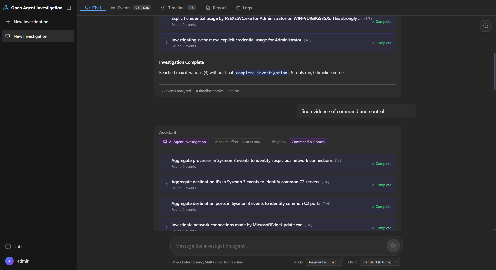
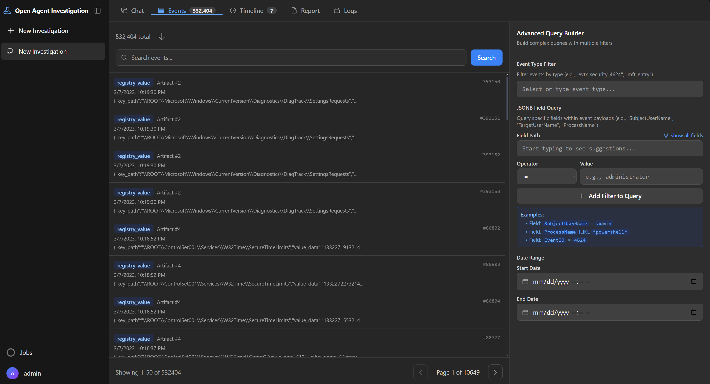
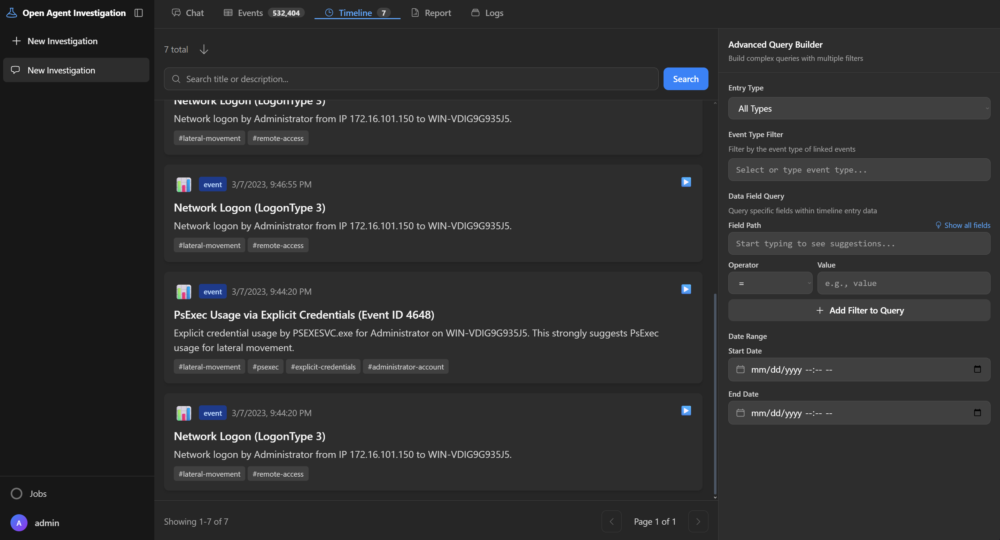
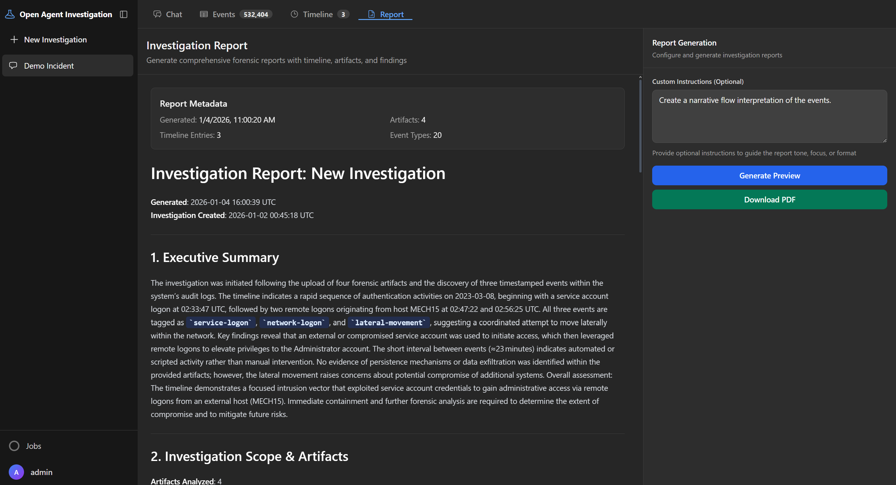

# Open Agent Investigation

A micro-forensics workbench for analyzing artifacts. It combines forensic parsing with LLM-driven investigation workflows to reconstruct evidence timelines, identify threats, and document findings.

**Developers Note**
> This is a work in progress. The requirements, specs and build order were human-generated and then I guided Claude for implementation and intervened manually for many issues (code, structure, etc). I'm intent on refactoring quite a lot of the naive logic and agent code as well as expanding the supported artifacts. Pull requests are welcome, if you'd like to help.

---

**Chat with RAG and agentic functionality**


---

**Analyze raw events**


---

**Build timelines**


---

**Generate reports**


---

## What It Does

- Parses Windows forensic artifacts (EVTX logs, registry hives, MFT, prefetch, LNK files)
- Routes natural language queries to specialized handlers using LLM-based intent classification
- Executes autonomous agent investigations with 16+ forensic tools
- Builds chronological evidence timelines with automatic event deduplication
- Generates investigation reports with PDF and Markdown export
- Provides semantic search over embedded event data using hybrid BM25 and vector similarity

## Who It Is For

- Digital forensic investigators analyzing Windows systems
- Incident response teams triaging security events
- Security operations centers (SOCs) investigating alerts
- Researchers exploring forensic automation techniques

## Why Was It Created?
- Practice interleaving agent/RAG logic
- Experience building a RAG + ReRanker

## Futures
- Expand artifact parsers
- Expand OS compatibility
- Tune Agent + RAG components


## High-Level Capabilities

### Query Routing

Four specialized handlers optimize for different query types:

- **Agent Handler**: Complex multi-step investigations with tool execution (16+ tools)
- **Timeline Handler**: Timeline CRUD operations with 5 specialized tools
- **General Chat**: Fast metadata queries without tool overhead
- **Augmented Chat**: Semantic search using RAG with hybrid BM25 + vector retrieval

The system automatically classifies user intent or accepts manual mode selection.

### Artifact Support

| Type | Format | Parser | Output Event Types |
|------|--------|--------|-------------------|
| Event Logs | .evtx | evtx | evtx_security_*, evtx_sysmon_* |
| Registry | SYSTEM, SOFTWARE, SAM, SECURITY, NTUSER.DAT | regipy | registry_value, registry_* |
| File System | $MFT | mft | mft_entry |
| Prefetch | *.pf | prefetch2es | prefetch_execution |
| Shortcuts | *.lnk | LnkParse3 | lnk_file |

### Evidence Timeline

Event-first architecture prevents data duplication:

- Timeline entries reference events by ID
- Complete event payloads auto-fetched on demand
- Unique constraint prevents duplicate entries
- Immutable source events preserve forensic integrity

### Agent Execution

Bounded turn execution with configurable depth:

- Quick: 5 turns maximum
- Standard: 10 turns maximum
- Thorough: 15 turns maximum
- Dynamic extension: Up to 30 total turns with justification

Each turn limited to 5 tool executions. Real-time progress streamed via WebSocket.

## Minimal Quickstart

### Prerequisites

- Docker 20.10+
- Docker Compose 2.0+
- LLM API access (OpenAI, Ollama, or compatible endpoint)

### Installation

```bash
git clone https://github.com/eheuser/open-agent-investigation.git
cd open-agent-investigation
docker-compose up -d
```

### Testing

```bash
docker-compose -f docker-compose.test.yml run --rm test-runner pytest tests/unit/ -v --tb=short
```

### Access

- UI: https://localhost
- API: http://localhost:8000/docs
- Default credentials: admin / admin123 (change immediately)


## Documentation
- [Full Documentation](docs/index.md) - Documentation Index
- [Getting Started](docs/getting-started.md) - Installation and configuration
- [Architecture](docs/architecture.md) - System design and data flow
- [User Guide](docs/user-guide.md) - Common workflows

## Architecture

```
UI (React) <--HTTPS/WSS--> API (FastAPI) <--SQL--> PostgreSQL <--Poll--> Worker (AsyncIO)
                                                        |
                                                    PGVector
                                                        |
                                                   LLM Backend
```

Components:

- **UI**: React 18 frontend with TypeScript and TailwindCSS
- **API**: FastAPI backend with SQLAlchemy 2.0 async ORM
- **Database**: PostgreSQL 15 with PGVector extension
- **Worker**: Async job processor with multiprocessing pool

Technology stack:

- Python 3.11+
- FastAPI 0.110
- React 18.2
- PostgreSQL 15
- Node.js 18+

## License

GNU General Public License v3.0. See [LICENSE](LICENSE) for full text.

## Security

### Authentication

- JWT token-based authentication (24-hour expiration)
- Argon2id password hashing (m=65536, t=3, p=4)
- Role-based access control (regular users, administrators)

### Data Protection

- API keys encrypted at rest using pg_crypto
- SSL/TLS for production deployments
- Prepared statements prevent SQL injection
- No plaintext password storage or transmission


### Operating Systems

- Linux (Ubuntu 20.04+, Debian 11+)
- macOS 12+
- Windows 10/11 with WSL2

### LLM Providers

- OpenAI (GPT-3.5, GPT-4, GPT-4 Turbo)
- Ollama (Llama 3, Mistral, Mixtral)
- Azure OpenAI Service
- LM Studio (OpenAI-compatible endpoint)
- Custom OpenAI-compatible endpoints

### Browsers

- Chrome 100+
- Firefox 100+
- Safari 15+
- Edge 100+

## Known Limitations

- Windows artifacts only (no Linux or macOS forensics)
- No memory forensics (Volatility integration planned)
- No network traffic analysis (PCAP support planned)
- Single investigation per user session
- PostgreSQL only (no alternative database backends)

## FAQ

### How does query routing work?

The system uses LLM-based intent classification to route queries to the most appropriate handler. Users can also manually select the routing mode (Auto, Agent, Timeline, Augmented Chat). Fallback keyword matching is used when LLM is unavailable.

### What is the difference between Agent and Augmented Chat modes?

Agent mode executes a bounded turn loop with 16+ forensic tools for complex multi-step investigations. Augmented Chat mode uses RAG (retrieval-augmented generation) with hybrid BM25 and vector search for semantic queries over embedded event data. Agent mode is more thorough but slower and more expensive. Augmented Chat is faster and optimized for semantic search.

### How are timeline entries different from events?

Events are immutable forensic records stored in the events table. Timeline entries reference events by ID and auto-fetch complete payloads. This event-first design prevents data duplication and ensures timeline accuracy.

### Can I use local LLMs instead of OpenAI?

Yes. Configure Ollama or LM Studio as your LLM provider. Both support OpenAI-compatible endpoints. No internet connection required for local models.

### What is the maximum investigation size?

Tested with over 1 million events per investigation. Practical limits depend on available RAM and storage. See resource requirements in [docs/getting-started.md](docs/getting-started.md).


## TODO

Items requiring investigation or completion:

- Embedding provider configuration validation
- Cloud deployment templates (AWS, Azure, GCP)
- Kubernetes manifests
- Memory forensics integration (Volatility)
- Network traffic analysis (PCAP parsing)
- Mobile forensics (Android/iOS)
- Multi-tenant database isolation strategy
- Distributed worker architecture

## Contact

- GitHub Issues: https://github.com/eheuser/open-agent-investigation/issues